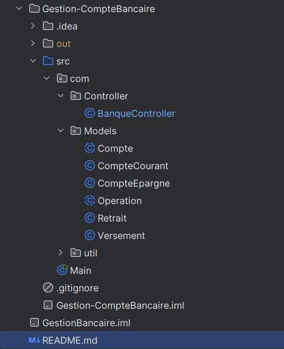
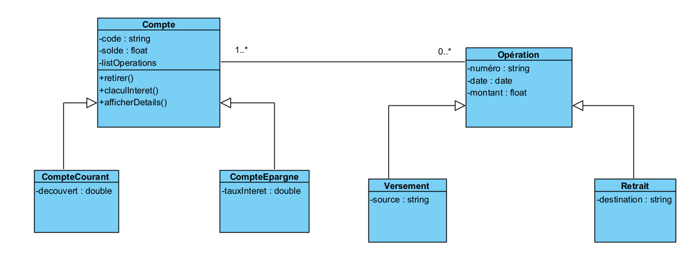

# Gestion Bancaire - Application Console Java

## Description du projet
Ce projet vise à développer une application console en Java 8 permettant de gérer les comptes bancaires et leurs opérations (versements, retraits, virements) pour une banque. L'objectif est de créer un système informatisé simple et efficace, en respectant les bonnes pratiques de conception orientée objet et une architecture claire .

Fonctionnalités principales :
- Créer un compte (Courant ou Épargne)
- Effectuer un versement dans un compte
- Effectuer un retrait d’un compte
- Effectuer un virement entre comptes
- Consulter le solde d’un compte
- Consulter la liste des opérations effectuées sur un compte

---

## Technologies utilisées
- **Java 8**
- Collections Java (`ArrayList`, `HashMap`)
- Java Time API (`LocalDateTime`)
- UUID pour l’identifiant unique des opérations
- Git pour le contrôle de version
- JDK et commandes `javac` / `java` pour compilation et exécution
- Console pour interface utilisateur (menu interactif)

---

## Structure du projet 

- **Structure**

- **Diagramme de class**

